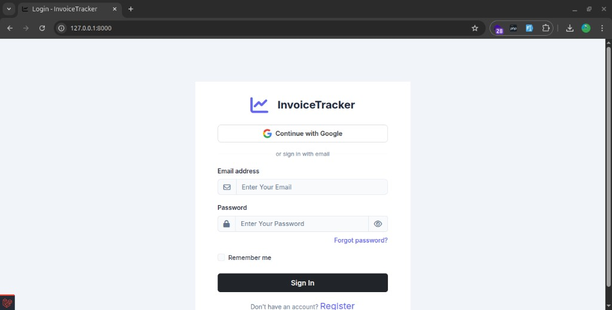
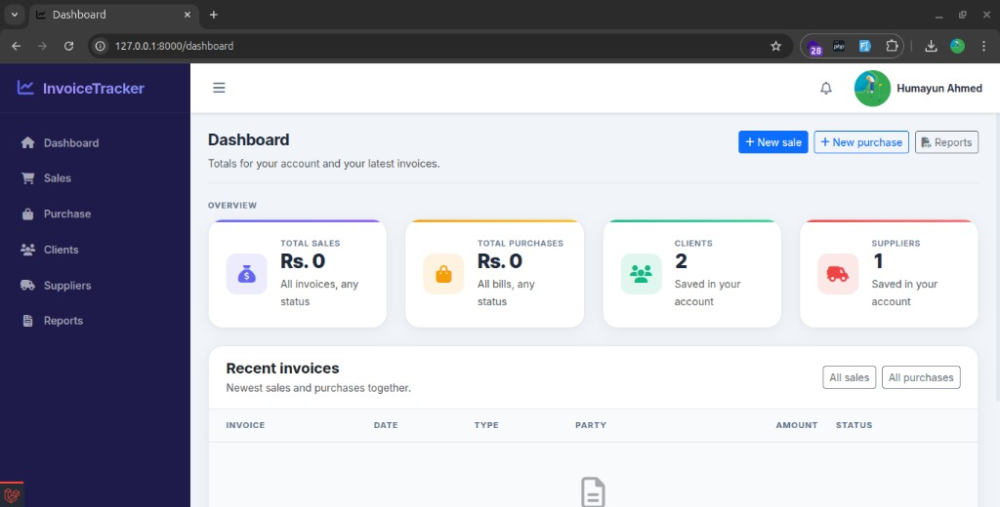
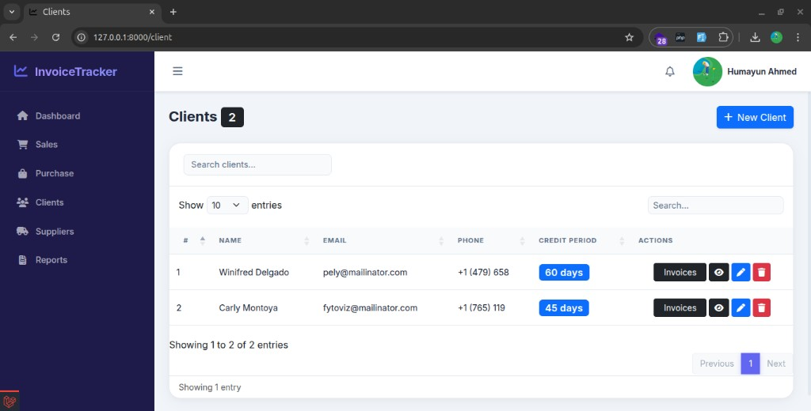

# Invoice Tracker

A Laravel application for tracking **sales** and **purchase** invoices, **clients** and **suppliers**, with PDF/Excel exports, **reports**, and a **dashboard**. Each user’s data is isolated (multi-tenant by `user_id`). Authentication uses **Laravel Fortify**; **Google sign-in** is optional via Laravel Socialite.

## Screenshots

### Login

Email/password and optional Google sign-in.



### Dashboard

Account totals, client/supplier counts, and recent invoices.



### Clients

Searchable client list with credit period and quick actions.



## Requirements

- **PHP** `^8.3` with common extensions: `pdo_mysql`, `mbstring`, `openssl`, `tokenizer`, `xml`, `ctype`, `json`, `bcmath`, `fileinfo` (and `zip` / `gd` as needed for Excel/PDF)
- **Composer** 2.x
- **Node.js** 18+ and **npm** (for Vite/Tailwind if you change frontend assets)
- **MySQL** 8+ (or MariaDB 10.3+), matching `.env.example`

## Quick start (local)

### 1. Clone and install PHP dependencies

```bash
git clone <repository-url> invoice-tracker
cd invoice-tracker
composer install
```

### 2. Environment

```bash
cp .env.example .env
php artisan key:generate
```

Edit `.env` and set your database:

- `DB_DATABASE`, `DB_USERNAME`, `DB_PASSWORD` (default database name in the example is `invoice_tracker`)

Create the MySQL database before migrating:

```sql
CREATE DATABASE invoice_tracker CHARACTER SET utf8mb4 COLLATE utf8mb4_unicode_ci;
```

### 3. Database

```bash
php artisan migrate
```

Optional demo user (see `database/seeders/DatabaseSeeder.php`):

```bash
php artisan db:seed
```

### 4. Storage link (profile photos)

```bash
php artisan storage:link
```

### 5. Run the app

```bash
php artisan serve
```

Open [http://127.0.0.1:8000](http://127.0.0.1:8000). Register a new account or use the seeded user if you ran `db:seed`.

### 6. Frontend assets (optional)

The main UI uses Blade views and files under `public/assets/`. The repo also includes **Vite** for `resources/css/app.css` and `resources/js/app.js`. If you work on those:

```bash
npm install
npm run build    # production build
# or
npm run dev      # dev server with HMR
```

## One-command setup (Composer)

After creating the MySQL database and configuring `.env`, you can run:

```bash
composer run setup
```

This runs `composer install`, ensures `.env`, `key:generate`, `migrate --force`, `npm install`, and `npm run build`. You still need MySQL reachable and `DB_*` correct first.

## Full local dev stack

To run the HTTP server, queue listener, log tail, and Vite together:

```bash
composer run dev
```

Requires Node/npm installed.

## Queues and scheduled tasks

`.env` uses `QUEUE_CONNECTION=database`. For queued jobs locally:

```bash
php artisan queue:work
```

A daily schedule runs overdue-invoice checks (`invoices:check-overdue` at 09:00). In development you can trigger the scheduler manually:

```bash
php artisan schedule:work
```

## Optional: Google OAuth

To enable “Sign in with Google”, add to `.env`:

```env
GOOGLE_CLIENT_ID=
GOOGLE_CLIENT_SECRET=
GOOGLE_REDIRECT_URL="${APP_URL}/auth/google/callback"
```

Configure the redirect URI in the Google Cloud console to match `GOOGLE_REDIRECT_URL`.

## Mail

By default `.env` uses `MAIL_MAILER=log` (emails go to the log). Change mail settings when you need real delivery.

## Tests

```bash
composer run test
# or
php artisan test
```

## License

This project uses the **MIT** license (see `composer.json` / Laravel defaults).
